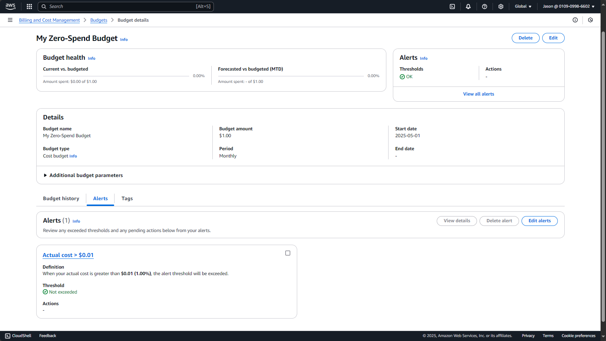

# w4d1-aws-setup

- **Set up an AWS account and created a new IAM user with Administrator access**

- **Set up a zero-spend budget to notify me if cost exceeds $0.01(1% of my budget)**

- **Read through some of DynamoDB's documentation to understand how it works**

- **Couple things that I found interesting about DynaboDB is it's ability to scale automatically**  
  **to support tables of just about any size and still maintain a consistent single-digit millisecond**  
  **performance level. If DAX is utilized, then it can be in microseconds.**

## Screenshot of my budget

